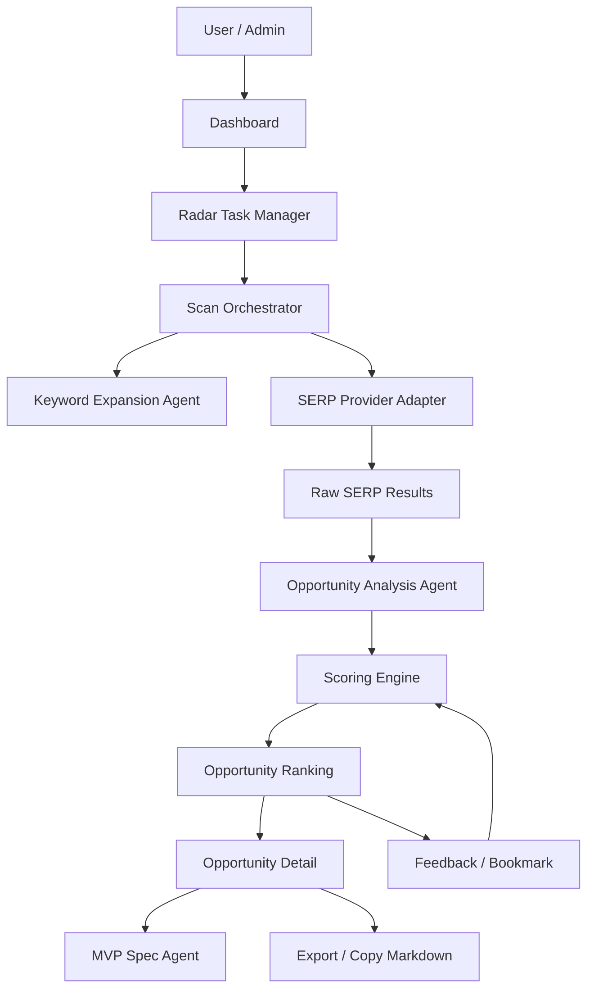

# 03 - 技术架构

## 架构目标

MicroGap Radar 的第一版要满足三个目标：

1. **可快速开发**：48 小时内完成可用 MVP。
2. **可替换数据源**：SERP provider、LLM provider、数据库都不要写死。
3. **可从自用升级到订阅制**：先 admin-only，后续扩展为多用户、多任务、多配额。

## 推荐技术栈

### 前端

- Next.js App Router
- TypeScript
- Tailwind CSS
- shadcn/ui 或自定义轻量组件
- React Hook Form + Zod，用于表单和输入校验

### 后端

- Next.js Route Handlers / Server Actions
- Prisma 或 Drizzle ORM
- PostgreSQL，优先 Supabase / Neon / Railway 等托管数据库
- 本地开发可先用 SQLite，但数据模型应兼容 PostgreSQL

### AI

- OpenAI API 或兼容 OpenAI 格式的 LLM provider
- Agent 不需要复杂框架，第一版用函数式 pipeline：
  - `expandKeywords()`
  - `analyzeSerp()`
  - `scoreOpportunity()`
  - `generateMvpSpec()`

### 搜索数据

使用 provider adapter，避免被单一 API 锁定。

可支持：
- SerpApi
- DataForSEO
- Brave Search API
- 自定义 mock provider

第一版必须实现 mock provider，确保无 API key 时也能开发和演示。

### 定时任务

- 48 小时 MVP：优先手动触发 `Run Scan`。
- V1：加入 Vercel Cron、GitHub Actions cron 或服务器 cron，调用 `/api/cron/daily-scan?secret=...`。

### 邮件

- 48 小时 MVP：不强制。
- V1：Resend / Postmark 发送每日 digest。

### 支付

- 48 小时 MVP：只做价格页和 paywall placeholder。
- V1：Stripe Checkout + webhook + quota。

## 系统模块



## 目录结构建议

```text
microgap-radar/
  app/
    page.tsx
    dashboard/
      page.tsx
    radar-tasks/
      page.tsx
      new/page.tsx
      [id]/page.tsx
    opportunities/
      page.tsx
      [id]/page.tsx
    api/
      scans/run/route.ts
      cron/daily-scan/route.ts
      opportunities/[id]/mvp-spec/route.ts
  components/
    app-shell.tsx
    radar-task-form.tsx
    opportunity-card.tsx
    score-badge.tsx
    serp-weakness-list.tsx
    mvp-spec-viewer.tsx
  lib/
    env.ts
    auth.ts
    db.ts
    utils.ts
    scoring.ts
    schemas.ts
  services/
    scan-orchestrator.ts
    serp/
      types.ts
      mock-provider.ts
      serpapi-provider.ts
      dataforseo-provider.ts
      index.ts
    llm/
      openai-client.ts
      json-output.ts
  agents/
    keyword-expansion-agent.ts
    serp-analysis-agent.ts
    opportunity-analysis-agent.ts
    mvp-spec-agent.ts
  prisma/
    schema.prisma
  tests/
    scoring.test.ts
    mock-scan.test.ts
```

## 核心流程

### 1. 创建 Radar Task

用户输入：
- 领域：例如 `Steam / Indie Game launch microtools`
- 目标市场：例如 `US, Japan, Germany`
- 语言：例如 `English, Japanese, German`
- 个人优势：例如 `GameDev, Unity, SEO, AI automation`
- 变现偏好：例如 `ads, affiliate, low-price export`
- 排除项：例如 `medical, legal conclusion, adult, gambling`

系统保存为 `radar_tasks`。

### 2. 扫描任务

触发方式：
- 手动点击 `Run Scan`
- 后续由 cron 自动触发

流程：
1. 从 task 生成 seed keywords。
2. 通过 AI 扩展成候选关键词。
3. 对每个关键词调用 SERP provider。
4. 保存 raw SERP。
5. 对 SERP 进行弱点分析。
6. 生成机会对象。
7. 计算评分。
8. 输出排行。

### 3. 机会分析

系统分析：
- 搜索意图是否强。
- 搜索结果是否弱。
- 是否有可交互工具缺口。
- 用户是否愿意付费。
- 是否可做广告、affiliate、低价导出、lead-gen。
- 是否涉及高风险领域。
- 是否适合当前用户的能力。

### 4. 机会详情

点击机会后显示：
- 关键词和目标市场。
- 推荐工具形态。
- 竞争弱点证据。
- 变现路径。
- 48 小时 MVP spec。
- 放弃条件。

## API 设计

### POST `/api/scans/run`

用途：手动运行某个 Radar task。

Request:
```json
{
  "radarTaskId": "task_123",
  "limit": 20,
  "useMockSerp": false
}
```

Response:
```json
{
  "scanRunId": "run_123",
  "status": "completed",
  "opportunityCount": 12
}
```

### GET `/api/opportunities`

Query:
```text
?radarTaskId=task_123&minScore=70&toolType=calculator&risk=low
```

Response:
```json
{
  "items": [
    {
      "id": "opp_123",
      "keyword": "steam short description generator",
      "totalScore": 83,
      "toolType": "generator",
      "market": "US",
      "language": "en",
      "summary": "A narrow AI generator for indie developers preparing Steam pages."
    }
  ]
}
```

### POST `/api/opportunities/[id]/mvp-spec`

用途：生成或重新生成机会的 MVP spec。

Request:
```json
{
  "format": "markdown",
  "depth": "compact"
}
```

Response:
```json
{
  "markdown": "# MVP Spec..."
}
```

### POST `/api/cron/daily-scan`

用途：定时任务入口。

Request header 或 query 需要 `CRON_SECRET`。

逻辑：
- 找到 active tasks。
- 每个 task 运行一次 scan。
- 记录错误但不中断全部任务。

## Provider Adapter

```ts
export type SerpSearchInput = {
  keyword: string;
  country?: string;
  language?: string;
  limit?: number;
};

export type SerpResult = {
  position: number;
  title: string;
  url: string;
  domain: string;
  snippet?: string;
  resultType?: "organic" | "ad" | "forum" | "pdf" | "video" | "unknown";
};

export interface SerpProvider {
  search(input: SerpSearchInput): Promise<SerpResult[]>;
}
```

## 评分引擎

评分引擎必须是普通 TypeScript 函数，便于测试和调参。

```ts
export type ScoreBreakdown = {
  intentScore: number;
  monetizationScore: number;
  serpWeaknessScore: number;
  toolabilityScore: number;
  userFitScore: number;
  buildSpeedScore: number;
  riskPenalty: number;
  totalScore: number;
};
```

不要只让 LLM 给总分。推荐方式：

1. LLM 先生成结构化判断。
2. 代码根据结构化字段计算分数。
3. LLM 再生成解释文本。

这样分数更稳定，也方便调参。

## 安全与合规边界

- 涉及法律、税务、医疗、金融等领域时，输出必须是 checklist / self-assessment，不给确定性结论。
- 机会 brief 不能承诺收益、排名或转化率。
- SERP 数据要遵守 provider 条款。
- 对外 SaaS 版本需要用户数据隔离和配额限制。

## 部署建议

### 48 小时 MVP

- Vercel 部署 Next.js。
- Supabase / Neon 托管 PostgreSQL。
- 手动运行 scan。
- mock provider 保底。

### V1

- 加入 cron。
- 加入 Resend digest。
- 加入 Stripe subscription。
- 加入配额控制。

### V2

- 后台 job queue。
- 多 provider fallback。
- 机会反馈闭环。
- 用户项目上线追踪。
