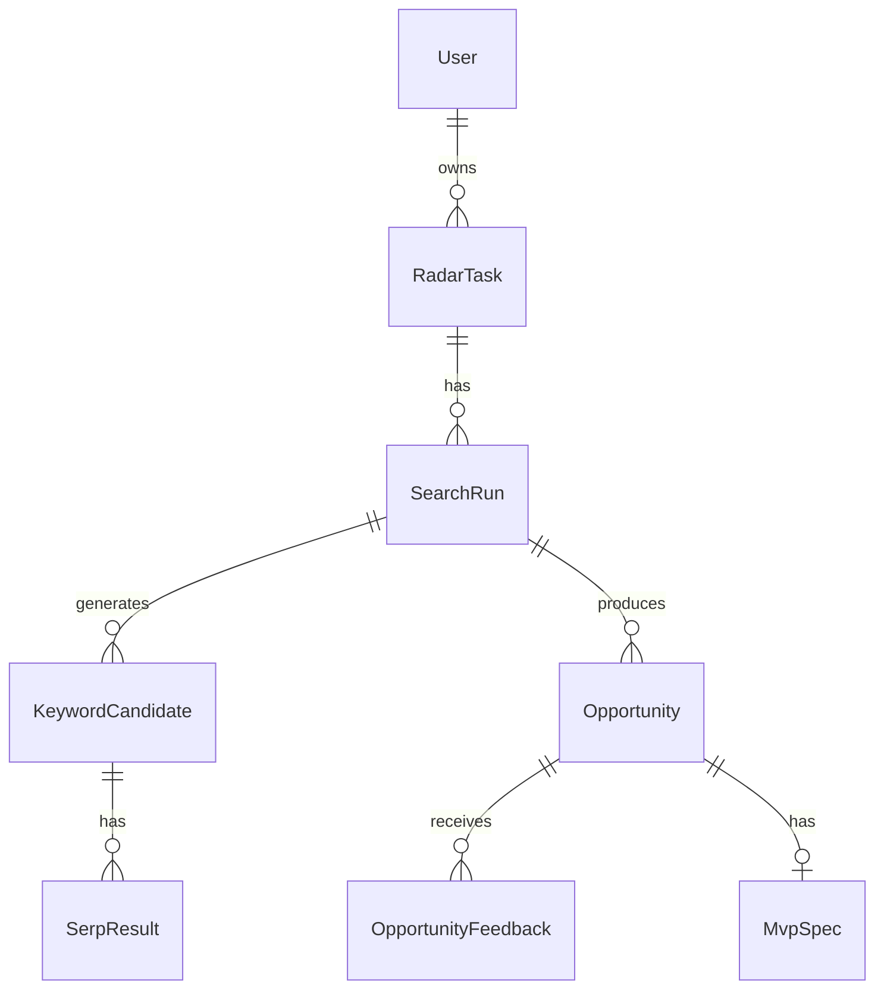

# 07 - 数据模型与评分系统

## 数据模型目标

数据模型需要支持四件事：

1. 保存用户定制的 Radar 任务。
2. 保存每次扫描过程和原始 SERP 数据。
3. 保存机会、评分和解释。
4. 保存用户反馈，用于后续校准。

## 实体关系



48 小时 MVP 可以先不做完整 User，多用户字段先保留。

## 表：users

V1 才需要完整用户系统。MVP 可用单 admin。

字段：

| 字段 | 类型 | 说明 |
|---|---|---|
| id | string | 主键 |
| email | string | 邮箱 |
| plan | string | free/starter/pro/studio |
| created_at | datetime | 创建时间 |
| updated_at | datetime | 更新时间 |

## 表：radar_tasks

| 字段 | 类型 | 说明 |
|---|---|---|
| id | string | 主键 |
| user_id | string nullable | 所属用户，MVP 可为空 |
| name | string | 任务名 |
| domain_description | text | 领域描述 |
| seed_examples | json | 种子关键词或样例 |
| countries | json | 目标国家数组 |
| languages | json | 目标语言数组 |
| user_advantages | json | 用户优势 |
| monetization_preferences | json | 变现偏好 |
| risk_preferences | json | 风险偏好 |
| excluded_topics | json | 排除主题 |
| daily_limit | int | 每日机会上限 |
| is_active | boolean | 是否启用 |
| created_at | datetime | 创建时间 |
| updated_at | datetime | 更新时间 |

示例：

```json
{
  "name": "GameDev Microtools",
  "domain_description": "Steam, Unity, indie game launch, game localization, game marketing microtools",
  "seed_examples": ["steam description generator", "game localization cost calculator"],
  "countries": ["US", "JP", "DE"],
  "languages": ["en", "ja", "de"],
  "user_advantages": ["GameDev", "Unity", "AI automation", "multi-language SEO"],
  "monetization_preferences": ["ads", "affiliate", "paid_export"],
  "risk_preferences": { "maxRisk": "medium", "avoidYMYLConclusions": true },
  "excluded_topics": ["medical", "adult", "gambling", "tax conclusions"]
}
```

## 表：search_runs

| 字段 | 类型 | 说明 |
|---|---|---|
| id | string | 主键 |
| radar_task_id | string | 所属任务 |
| status | string | pending/running/completed/failed/partial_failed |
| started_at | datetime | 开始时间 |
| completed_at | datetime nullable | 结束时间 |
| keyword_count | int | 候选关键词数量 |
| serp_success_count | int | 成功获取 SERP 数量 |
| opportunity_count | int | 输出机会数量 |
| estimated_cost | decimal nullable | 估算 API 成本 |
| error_message | text nullable | 错误信息 |
| created_at | datetime | 创建时间 |

## 表：keyword_candidates

| 字段 | 类型 | 说明 |
|---|---|---|
| id | string | 主键 |
| search_run_id | string | 所属 scan |
| keyword | string | 候选关键词 |
| country | string | 目标国家 |
| language | string | 目标语言 |
| intent_type | string | generator/checker/calculator/template/checklist/audit |
| rationale | text | 为什么生成这个词 |
| status | string | pending/searched/failed |
| created_at | datetime | 创建时间 |

## 表：serp_results

| 字段 | 类型 | 说明 |
|---|---|---|
| id | string | 主键 |
| keyword_candidate_id | string | 所属关键词 |
| provider | string | SERP provider |
| position | int | 排名位置 |
| title | string | 标题 |
| url | text | URL |
| domain | string | 域名 |
| snippet | text nullable | 摘要 |
| result_type | string | organic/ad/forum/pdf/video/unknown |
| raw_json | json nullable | 原始数据 |
| created_at | datetime | 创建时间 |

## 表：opportunities

| 字段 | 类型 | 说明 |
|---|---|---|
| id | string | 主键 |
| search_run_id | string | 所属 run |
| radar_task_id | string | 所属 task |
| keyword | string | 目标关键词 |
| country | string | 目标国家 |
| language | string | 目标语言 |
| title | string | 机会标题 |
| summary | text | 一句话总结 |
| tool_type | string | generator/checker/calculator/template/checklist/audit/directory |
| target_user | text | 目标用户 |
| search_intent | text | 搜索意图 |
| serp_weakness_summary | text | SERP 弱点 |
| monetization_summary | text | 变现摘要 |
| risk_summary | text | 风险摘要 |
| build_complexity | string | low/medium/high |
| status | string | new/saved/discarded/build_next/built |
| total_score | int | 总分 0-100 |
| score_breakdown | json | 分项分数 |
| score_explanation | json | 分项解释 |
| raw_analysis | json | AI 原始结构化输出 |
| created_at | datetime | 创建时间 |
| updated_at | datetime | 更新时间 |

## 表：mvp_specs

| 字段 | 类型 | 说明 |
|---|---|---|
| id | string | 主键 |
| opportunity_id | string | 所属机会 |
| markdown | text | MVP spec markdown |
| generated_by_model | string | 模型 |
| created_at | datetime | 创建时间 |
| updated_at | datetime | 更新时间 |

## 表：opportunity_feedback

| 字段 | 类型 | 说明 |
|---|---|---|
| id | string | 主键 |
| opportunity_id | string | 所属机会 |
| feedback_type | string | saved/discarded/build_next/built/result_update |
| reason | text nullable | 原因 |
| real_impressions | int nullable | 真实展示 |
| real_clicks | int nullable | 真实点击 |
| real_revenue | decimal nullable | 真实收入 |
| notes | text nullable | 备注 |
| created_at | datetime | 创建时间 |

## 机会评分公式

### 总分公式

```text
total_score =
  intent_score * 0.18 +
  monetization_score * 0.16 +
  serp_weakness_score * 0.18 +
  toolability_score * 0.18 +
  user_fit_score * 0.14 +
  build_speed_score * 0.10 -
  risk_penalty * 0.06
```

然后限制到 0-100：

```text
total_score = clamp(round(total_score), 0, 100)
```

### 分项解释

#### 1. intent_score 搜索意图强度

评分依据：
- 是否包含 generator/checker/calculator/template/checklist/cost/requirements 等任务词。
- 用户是否明显想完成一件事。
- 用户是否可能输入自己的信息获得个性化结果。

建议：
- 90-100：用户明确要生成/计算/检查某个结果。
- 70-89：用户有较强任务意图，但可能也只是学习。
- 40-69：信息查询为主，工具化需要包装。
- 0-39：泛知识词，不建议做。

#### 2. monetization_score 变现潜力

评分依据：
- 是否能广告变现。
- 是否有 affiliate 产品。
- 是否适合低价导出。
- 是否能 lead-gen。
- 用户是否有商业压力。

建议：
- 90-100：有多个变现口，且用户商业意图强。
- 70-89：至少有一个清晰变现口。
- 40-69：可广告，但直接付费弱。
- 0-39：难变现。

#### 3. serp_weakness_score SERP 弱点

评分依据：
- 前排是否有论坛/Reddit/Quora。
- 前排是否有老旧文章。
- 前排是否有 PDF / 政府页面 / 低体验页面。
- 前排是否缺少交互工具。
- 前排是否被大站垄断。
- 是否有小站排名。

建议：
- 90-100：SERP 明显弱，且缺少工具。
- 70-89：有弱点，但仍有部分强站。
- 40-69：竞争中等，需要差异化。
- 0-39：成熟 SaaS 或权威站垄断。

#### 4. toolability_score 工具化程度

评分依据：
- 是否可通过表单 + AI 输出解决。
- 是否有明确输入/输出。
- 输出是否能直接保存、复制、导出。
- 是否能在 48 小时内开发。

建议：
- 90-100：天然适合 generator/checker/calculator。
- 70-89：适合 checklist/audit/template。
- 40-69：能工具化，但需要复杂数据。
- 0-39：不适合工具化。

#### 5. user_fit_score 个人适配度

评分依据：
- 是否符合用户技能。
- 是否符合用户语言市场。
- 是否符合用户变现偏好。
- 是否符合用户风险边界。

建议：
- 90-100：强匹配。
- 70-89：中高匹配。
- 40-69：可做但没有明显优势。
- 0-39：不建议该用户做。

#### 6. build_speed_score 构建速度

评分依据：
- 是否能在 48 小时内 MVP。
- 是否需要外部数据。
- 是否需要复杂用户系统。
- 是否需要人工审核。

建议：
- 90-100：一天内可做。
- 70-89：两天内可做。
- 40-69：一周内可做。
- 0-39：重项目。

#### 7. risk_penalty 风险惩罚

惩罚依据：
- 法律、税务、医疗、金融确定性建议。
- 儿童隐私。
- 成人、博彩、灰产。
- 侵权风险。
- 高维护成本。

建议：
- 0-10：低风险。
- 11-35：中风险，需要免责声明。
- 36-70：高风险，不适合自动化。
- 71-100：应排除。

## SERP 弱点信号 schema

```json
{
  "weakSignals": [
    {
      "type": "forum_result",
      "strength": 0.8,
      "evidence": "Reddit result appears in top 5."
    },
    {
      "type": "no_interactive_tool",
      "strength": 0.9,
      "evidence": "Top results are articles; no generator/checker found."
    }
  ],
  "strongSignals": [
    {
      "type": "established_saas",
      "strength": 0.5,
      "evidence": "One mature SaaS ranks in top 3."
    }
  ]
}
```

## 机会状态流

```text
new → saved → build_next → built
new → discarded
saved → discarded
built → result_update
```

## 放弃条件字段

每个机会都应生成 `kill_criteria`：

示例：

```json
{
  "killCriteria": [
    "If SERP is dominated by 5+ mature SaaS tools after manual review, discard.",
    "If MVP requires verified legal advice, do not build as an automated tool.",
    "If no clear paid export or affiliate angle exists, only build if search volume appears strong."
  ]
}
```

## MVP 阶段的数据库简化

为了 48 小时内完成，可以只建：

- `radar_tasks`
- `search_runs`
- `keyword_candidates`
- `serp_results`
- `opportunities`
- `mvp_specs`

`users` 和 `feedback` 可以后置。
